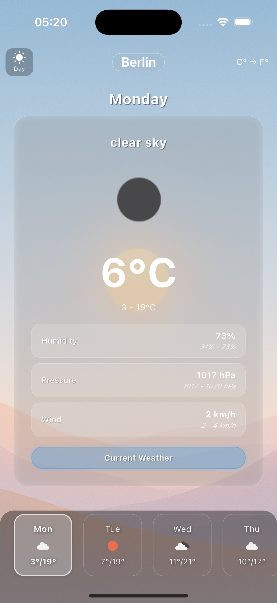

# Weather Forecast App



## Features

- **Current Weather Data**: Get up-to-date information about the current weather conditions including temperature, humidity, wind speed, and pressure
- **5-Day Forecast**: Plan ahead with detailed forecasts for the next five days
- **City Search**: Look up weather information for any city around the world
- **Beautiful UI**: Dynamic backgrounds that change based on weather conditions
- **Day/Night Mode**: Automatic theme switching based on time of day or manual override
- **Temperature Units**: Toggle between Celsius and Fahrenheit with a single tap

## Requirements

- Flutter 3.0.0 or higher
- Dart 2.17.0 or higher
- OpenWeatherMap API key

## Getting Started

1. Clone this repository
2. Run `flutter pub get` to install dependencies
3. Create a `.env` file in the root directory with the following content:
   ```
   OPENWEATHERMAP_API_KEY=your_api_key_here
   ```
4. Run the app using `flutter run`

## Technical Implementation

This app follows a structured architecture that separates concerns and makes the codebase maintainable:

### Directory Structure

```
lib/
├── main.dart
├── models/       # Data models
├── providers/    # State management
├── screens/      # UI components
├── services/     # API and business logic
└── utils/        # Utilities and constants
```

### Key Components

- **Models**: Clean, type-safe representation of API responses
- **Provider Pattern**: Efficient state management using the Provider package
- **OpenWeatherMap API**: Real-time data from a reliable weather service
- **Responsive UI**: Adapts perfectly to different screen sizes and orientations
- **Environment Variables**: Secure storage of API keys using .env file

## Design Choices

I wanted to create a visually appealing app that feels natural to use. The weather backgrounds change dynamically based on current conditions, giving users immediate visual cues about the weather. The UI elements are purposefully minimal to keep focus on the important information.

For the code architecture, I chose the Provider pattern for state management as it offers a good balance between simplicity and power. The separation between UI components and business logic makes the app easier to test and maintain.

## Acknowledgements

This project uses the OpenWeatherMap API for weather data. Icons and background images are designed to create an immersive weather experience.
